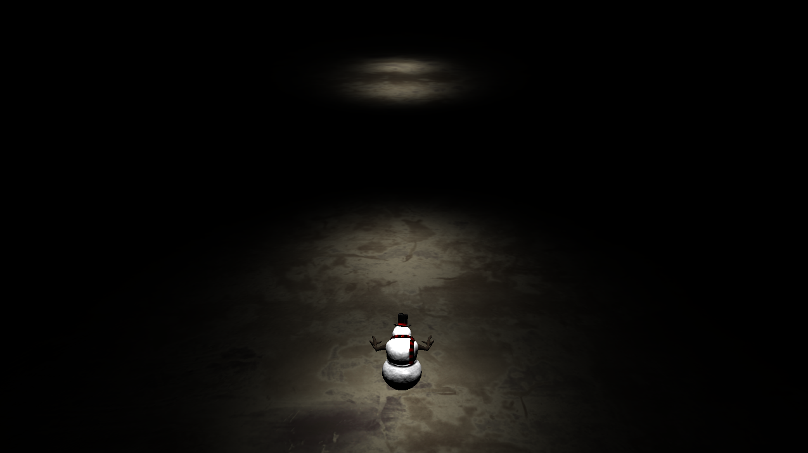

## GGP-TechDemo
Final project for Foundations of Games Graphics Programming. Engine built from the ground up using DirectX 11. The player controls an snowman, and will be reset if they stray out of the light. The initial vision was to have a full game demo with switches to control light movements and moving platforms, but due to issues with texture loading (tinyOBJLoader didn't want to work with my solution) and collision detection, I had to stick with a tech demo.

## Features 
Model loading, PBR textures, skybox, swinging spotlights, player movement, limited camera movements (third person, but can look slightly left and right), basic cone-box collision detection.